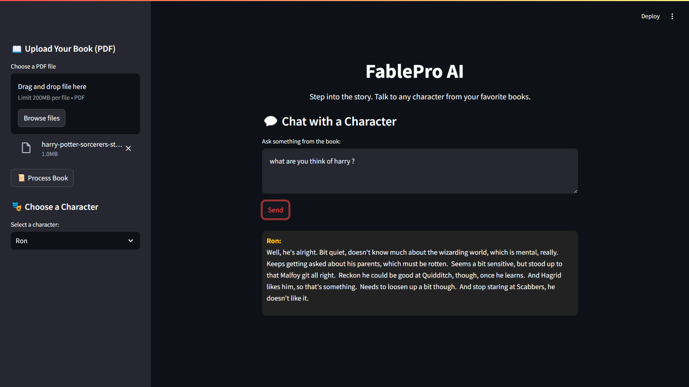

<div align="center">
  <h1>FablePro AI</h1>
  <p><em>Step into the story. Talk to any character from your favorite books.</em></p>
  
  [](https://www.python.org/downloads/)
  [](https://streamlit.io/)
  [](https://www.gnu.org/licenses/gpl-3.0.en.html)
  [](https://ai.google.dev/)
</div>

---

## ✨ Features

- **🔍 Character Recognition**: Automatically identifies key characters from your book
- **🗣️ Character Conversations**: Interact with characters in their authentic voice
- **📚 PDF Support**: Upload any PDF book and start chatting in minutes
- **🧠 Context-Aware**: Responses based on the actual content of your book
- **🎭 Role-Playing**: Characters respond as they would in their story world

<div align="center">
  
</div>

## 🚀 Quick Start

### Prerequisites
- Python 3.8+
- Google Gemini API key

### Installation
For a detailed setup guide, see [setup.md](docs/setup.md)

```bash
# Clone the repository
git clone https://github.com/yourusername/FablePro-AI.git
cd FablePro-AI

# Set up virtual environment
python -m venv venv
source venv/bin/activate  # On Windows: venv\Scripts\activate

# Install dependencies
pip install -r requirements.txt
python -m spacy download en_core_web_sm

# Create .env file with your API key
echo "GEMINI_API_KEY=your_api_key_here" > .env

# Run the application
streamlit run characterbot.py
```

## 🎮 How to Use
For a detailed usage guide, see [usage.md](docs/usage.md)


### 1. Upload a Book
Select any PDF book from your collection and process it.

### 2. Character Selection
Choose from automatically detected characters.

### 3. Start Chatting
Ask questions and get in-character responses.

## 🧩 How It Works

FablePro AI uses a powerful combination of technologies:

1. **Text Extraction**: Extracts content from PDF books
2. **Character Recognition**: Uses NLP to identify key characters
3. **Vector Database**: Stores text chunks for context retrieval
4. **Semantic Search**: Finds relevant passages for each query
5. **Generative AI**: Creates authentic character responses using Google Gemini

<div align="center">
  
</div>

For troubleshooting, see [troubleshooting.md](docs/troubleshooting.md)
## 🛠️ Technical Details

- **Frontend**: Streamlit for a clean, interactive UI
- **Embeddings**: Google Generative AI Embeddings for semantic understanding
- **Vector Storage**: FAISS for efficient similarity search
- **NLP Processing**: spaCy for named entity recognition
- **AI Model**: Google Gemini for natural language generation

## 📚 Project Structure

```
FablePro-AI/
│── app.py                 # Main Streamlit application
│── process_book.py        # Handles book processing
│── vector_store.py        # Manages vector embeddings
│── requirements.txt       # Python dependencies
│── .env.example           # Example environment file
│── docs/                  # Documentation folder
│   │-- setup.md           # Detailed setup instructions
│   │-- usage.md           # How to use the application
│   │-- troubleshooting.md  # Common issues and solutions
│── assets/                # Screenshots for README
│── README.md              # Project documentation
```

## 🤝 Contributing

Contributions are welcome! Please feel free to submit a Pull Request.

1. Fork the repository
2. Create your feature branch (`git checkout -b feature/amazing-feature`)
3. Commit your changes (`git commit -m 'Add some amazing feature'`)
4. Push to the branch (`git push origin feature/amazing-feature`)
5. Open a Pull Request

## 📝 License

This project is licensed under the GNU General Public License v3.0 (GPL-3.0) - see the [LICENSE](LICENSE) file for details.

The GPL-3.0 is a strong copyleft license that requires anyone who distributes your code or a derivative work to make the source available under the same terms. This ensures that all modifications and extended versions of the program remain free software.

## 🙏 Acknowledgements

- [Google Generative AI](https://ai.google.dev/) for the powerful AI model
- [Streamlit](https://streamlit.io/) for the web interface framework
- [FAISS](https://github.com/facebookresearch/faiss) for vector similarity search
- [spaCy](https://spacy.io/) for natural language processing

---

<div align="center">
  <p>Built with ❤️ by Shreyas</p>
</div>
